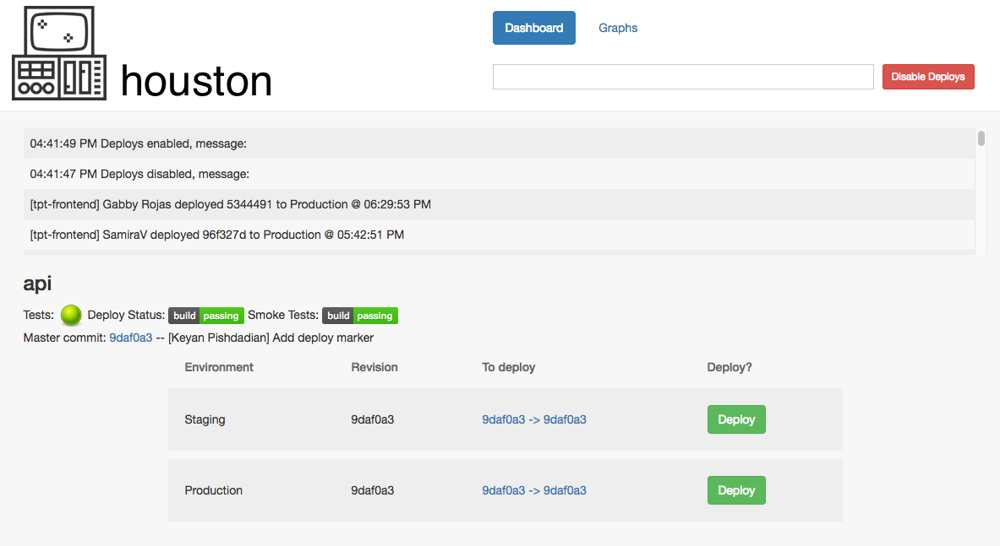
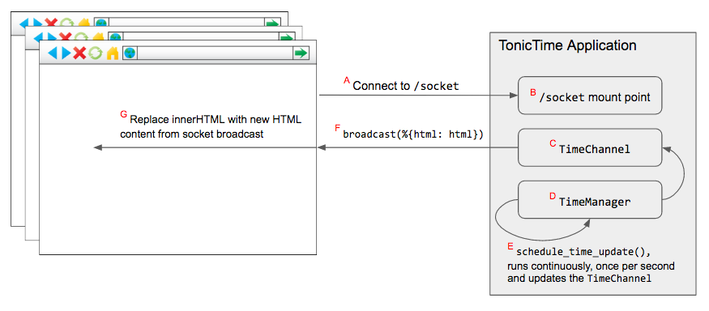

title: A Refreshing Tonic, Realtime Updates with Phoenix Channels
slug: tonic
date: 2017-05-23 20:06:23
Tags: elixir, phoenix, html, web, frontend, functional, websockets, channels, realtime
Status: published

Over the last few months I've been working in [Elixir][elixir] and its most popular web framework [Phoenix][phoenix]. During this time I built "Houston", a deployment tool written in Elixir/Phoenix to help make deploying at [TpT][tpt] easier by providing a simple uniform interface to all of [our Jenkins Pipelines][jenkinsfiles]. The Houston interface shows a number of important pieces of time-sensitive information that I needed to keep up-to-date so developers could coordinate deployments more effectively. I wanted to minimize the usage of other frameworks and tackle the problem quickly. I read about the team at [thoughtbot][thoughtbot] using [Phoenix Channels in lieu of React][replace_react] to deliver updated content to the browser and decided that using Channels would allow me to implement realtime updates easily by leveraging Phoenix directly.

A few weeks ago I had the pleasure of pairing with [Chris McCord][chris], one of the co-creators of the Phoenix framework, when TpT invited him to help with our migration to Elixir. One of the things we worked on together was implementing realtime updates for Houston with Channels. The Houston code is unfortunately still closed source, but I have created a simple application, TonicTime, to demonstrate the same Channel concepts. You can see the code [on GitHub][tonic_time] or visit the live demo at: <http://demo.keyanp.com/time>. The code on GitHub is slightly modified from the snippets here due to how it is being hosted.

After a short blurb about Channels we will look at the most important snippets from TonicTime to see how it all works.

## What are Phoenix Channels?

Channels are a simple high-level abstraction for developing realtime components in Phoenix applications using WebSockets. Channels allow for interaction between application components that are not Elixir processes without building out a separate pub/sub system or using a third-party service like [Pusher][pusher].

## Using Channels

If you've visited the live demo you will have noticed that the time on the page is constantly updating without reloading the page or submitting a new web request. So how is this happening? Below is a diagram of some of the components involved. We'll look at the Javascript/HTML first and then the supporting Elixir modules. The lettered interaction stages are referenced below as we walk through the code.

### HTML

The index template contains only one `div` with the current time inside, [`web/templates/page/index.html.eex`][index_github]:

    :::code
    

      <h2><%= @time_now %></h2>
    

Above `@time_now` is accessing a variable passed to the template in the `assigns` map. The Phoenix docs go into more detail about this, see [`Phoenix.View.render/3`][render_docs].

### Javascript

All of our Javascript is in [`web/static/js/app.js`][app_js_github], it opens a socket connection to our application's mount point (A) and also specifies that we should replace the innerHTML content when receiving update messages (G):

    :::javascript
    // We set an explicit id on the div in our HTML to allow
    // us to easily access it and replace its content.
    let container = document.getElementById("clock")

    // The code on GitHub connects to "/time/socket", this is due
    // to how TonicTime is deployed. The socket endpoint just needs
    // to match the socket created in the TonicTime.Endpoint module.
    let socket = new Socket("/socket")
    socket.connect()

    let timeChannel = socket.channel("time:now")

    // When an `update` message is received we replace the contents
    // of the "clock" element with server-side rendered HTML.
    timeChannel.on("update", ({html}) => container.innerHTML = html)

    // Attempt to connect to the WebSocket (Channel).
    timeChannel.join()
    .receive("ok", resp => console.log("joined time channel", resp))
    .receive("error", reason => console.log("failed to join", reason))

### Elixir

There are a number of moving parts here:

1. The socket mount-point (B) needs to be defined in our [`Endpoint`][endpoint] setup. As mentioned above, this needs to match the socket endpoint that we attempt to connect to in our Javascript code:

        :::elixir
        socket "/socket", TonicTime.UserSocket

2. The function [`Page.Controller.index`][page_controller] which handles `GET` requests to the index:

        :::elixir
        def index(conn, _params) do
          # Get the time from the TimeManager state, we'll look at this
          # in detail below.
          time_now = TimeManager.time_now()

          # Render the template `index.html` passing `time_now` in
          # the `assigns` map.
          render conn, "index.html", [time_now: time_now]
        end

3. The [`TimeChannel`][time_channel] Channel (C) which listens for updates and alerts subscribers:

        :::elixir
        defmodule TonicTime.TimeChannel do
          use TonicTime.Web, :channel

          # Client method called after an update.
          def broadcast_update(time) do
            # Render the template again using the new time.
            html = Phoenix.View.render_to_string(
                TonicTime.PageView,
                "index.html",
                [time_now: time]
            )

            # Send the updated HTML to subscribers.
            TonicTime.Endpoint.broadcast(
                "time:now",
                "update",
                %{html: html}
            )
          end

          # Called in `app.js` to subscribe to the Channel.
          def join("time:now", _params, socket) do
            {:ok, socket}
          end
        end

4. The [`TimeManager`][time_manager] GenServer (D) which holds the current time in its state, and is also responsible for triggering updates to the time (E). If you look at the full file you'll see there is a lot of code there to facilitate interaction with the GenServer. Most of this is not important to understanding Channels, the most relevant function is below:

        :::elixir
        defp update_time do
          updated_time =
            "US/Eastern"
            |> Timex.now()
            |> Timex.format!("%I:%M:%S %p", :strftime)

          # Schedule another update call to happen in 1 second.
          schedule_time_update()

          # Send the updated to our Channel so it can update clients.
          TonicTime.TimeChannel.broadcast_update(updated_time)

          %{clock: updated_time}
        end

## Conclusion

By leveraging Channels I was able to reduce the use of another framework in my project and still provide users with seamless dynamic page content. While we have looked at a trivial example of what Channels can do, there are many possibilities and native support in Phoenix makes implementation fast and natural.

Hopefully through this overview I was able to provide you with an easy to follow introduction to Channels and a framework for implementing them in your own projects.

## Credits

A huge thanks to [Chris McCord][chris] who walked me through Channels and their usage in Phoenix. Credit for the pun in the title, "A refreshing tonic", goes to my fantastic friend and coworker [Shanti Chellaram][shanti], who is almost as good as making up puns as she is at programming. And finally a big thanks to [Ryan Sydnor][ryan] for his help with building Houston, his many edits to this post, and his endless enthusiasm.

[jenkinsfiles]: http://keyanp.com/what-to-expect-when-youre-expectingto-write-a-jenkinsfile.html
[pusher]: https://pusher.com/
[thoughtbot]: https://thoughtbot.com/
[endpoint]: https://github.com/keyan/tonic-time/blob/8da4079570eddbbf340b897681dc2ae8423b4408/lib/tonic_time/endpoint.ex#L4
[time_channel]: https://github.com/keyan/tonic-time/blob/master/web/channels/time_channel.ex
[time_manager]: https://github.com/keyan/tonic-time/blob/master/lib/tonic_time/time_manager.ex
[page_controller]: https://github.com/keyan/tonic-time/blob/6caacb2027b0f275b82d083262a9fd68d890d064/web/controllers/page_controller.ex#L6-L9
[index_github]: https://github.com/keyan/tonic-time/blob/master/web/templates/page/index.html.eex
[render_docs]: https://hexdocs.pm/phoenix/Phoenix.View.html#render/3
[app_js_github]: https://github.com/keyan/tonic-time/blob/master/web/static/js/app.js
[shanti]: https://github.com/shantiii
[tonic_time]: https://github.com/keyan/tonic-time
[channel_docs]: http://www.phoenixframework.org/docs/channels
[elixir]: http://elixir-lang.org/
[phoenix]: http://www.phoenixframework.org/
[tpt]: https://teacherspayteachers.com
[chris]: https://github.com/chrismccord
[replace_react]: https://robots.thoughtbot.com/how-we-replaced-react-with-phoenix
[ryan]: https://github.com/ryansydnor
